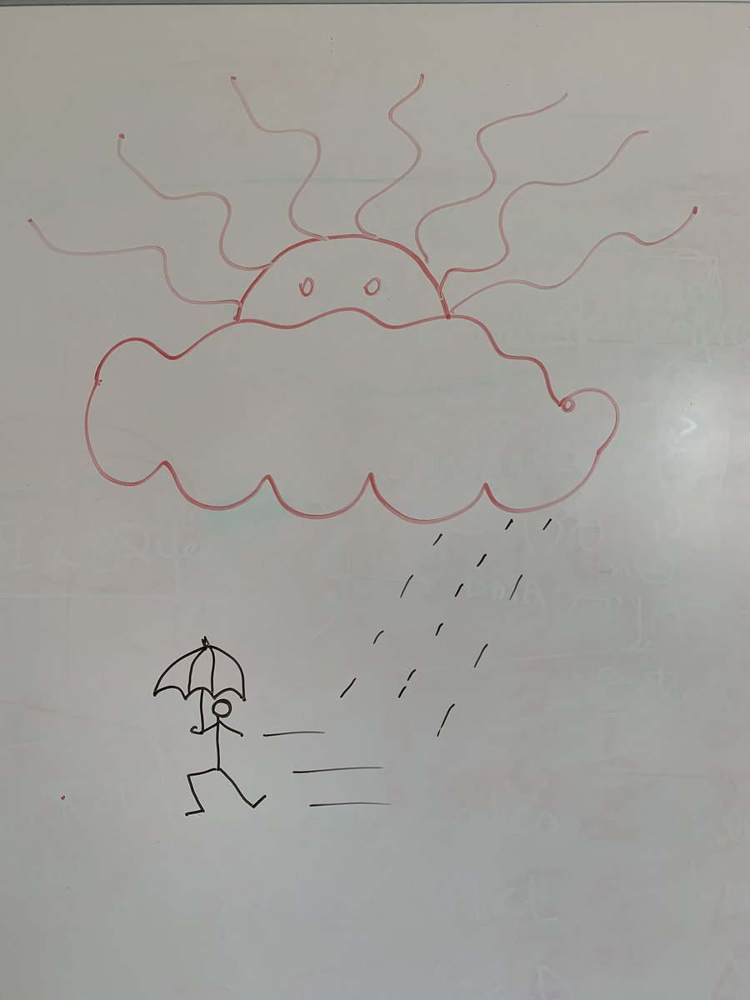

> “Please draw your project state on the whiteboard” is one of my Quality Control \(QA\) questions to open the conversation with the project manager\. Today, this PM surprised me, creatively\. 
> 
> 

 [Thu Apr 11 13:36:54 +0000 2019](https://twitter.com/DromerDenker/status/1116334307491053568)