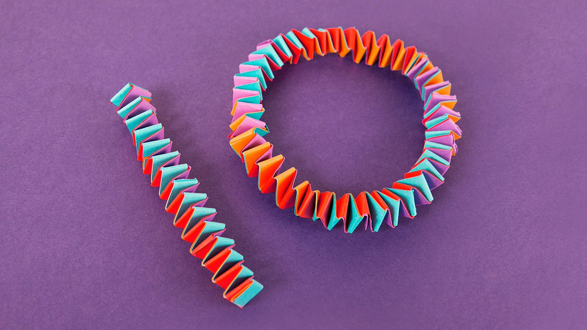

> I joined Twitter to poke fun at it, show how useless it is, but giving it a chance\.  
> Using it, I fell in love with the poetic challenge to state my case succintly, tweet\-sized\.   
> It's useful, it's free speech\.   
> Thanks @ariekanarie for introducing me\.  \#MyTwitterAnniversary 
> 
> 

 [Thu Apr 16 08:11:30 +0000 2020](https://twitter.com/DromerDenker/status/1250698317107003397)