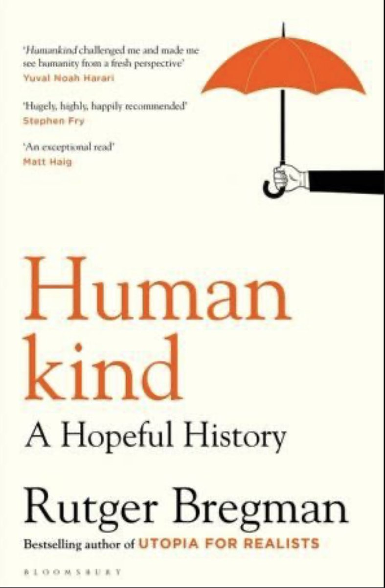

> The book Humankind \(⁦@rcbregman⁩ \) is a wholesome read\. Tells a story of why to have more faith in people\. And mutual trust\.  
> I read the original in NL and gifted the English version to a British colleague\. Left it on his desk\.  
>   
> And it got stolen from there\. \#irony 
> 
> 

 [Sat Feb 04 21:26:17 +0000 2023](https://twitter.com/DromerDenker/status/1621983507928031233)